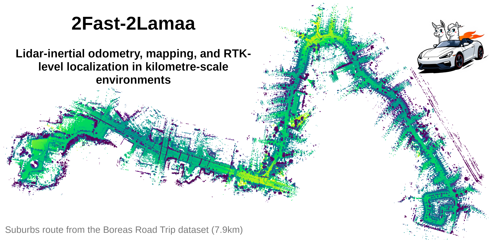

# 2Fast-2Lamaa

This repository contains our open-source implementation of __2Fast-2Lamaaa__, a lidar-inertial mapping and localisation framework for large-scale environments.


__13/02/2026 EDIT__: Adding a gravity constraint in the GP-map registration (if IMU is used: need to remap the topics). Improves Boreas-RT's metrics (tested with suburbs, tunnel,skyway, and regional (formerly called "hygway")). Not tested yet on other datasets.

__09/01/2026 EDIT__: Changing the PH-tree-based spatial indexing to the [i-Octree](https://github.com/zhujun3753/i-octree). Faster and less memory consumption. The paper will be updated accordingly in the next revision.

__31/12/2025 EDIT__: Now 2Fast-2Lamaa can be used __without an IMU__. In the parameters you can specify one of three modes for the lidar-odometry node: `imu`, `gyr`, and `no_imu`.
The first mode uses both accelerometer and gyroscope preintegration to undistort the lidar scans (as in the paper), the second mode uses only gyroscope preintegration and assumes constant linear velocity (global frame), and the last mode assumes constant linear (global frame) and angular velocity.
These new variants will be added to the paper's ablation study in the next revision.




__If you are looking to use the undistortion-related code from our IROS publication, or the first version of 2Fast-2Lamaa, please refer to the `old` branch.__

### Abstract

This paper introduces 2Fast-2Lamaa, a lidar-inertial state estimation framework for odometry, mapping, and localization.
Its first key component is the optimization-based undistortion of lidar scans, which uses continuous IMU preintegration to model the system's pose at every lidar point timestamp.
The continuous trajectory over 100-200ms is parameterized only by the initial scan conditions (linear velocity and gravity orientation) and IMU biases, yielding eleven state variables.
These are estimated by minimizing point-to-line and point-to-plane distances between lidar-extracted features without relying on previous estimates, resulting in a prior-less motion-distortion correction strategy.
Because the method performs local state estimation, it directly provides scan-to-scan odometry.
To maintain geometric consistency over longer periods, undistorted scans are used for scan-to-map registration.
The map representation employs Gaussian Processes to form a continuous distance field, enabling point-to-surface distance queries anywhere in space.
Poses of the undistorted scans are refined by minimizing these distances through non-linear least-squares optimization.
For odometry and mapping, the map is built incrementally in real time; for pure localization, existing maps are reused.
The incremental map construction also includes mechanisms for removing dynamic objects.
We benchmark 2Fast-2Lamaa on over 750km of public and self-collected datasets from both automotive and handheld systems.
The framework achieves state-of-the-art performance across diverse and challenging scenarios, reaching odometry and localization errors as low as 0.22\% and 0.06 m, respectively.


A thourough presentation and performance analysis of 2Fast-2Lamaa is available in our [paper's preprint](https://arxiv.org/abs/2410.05433) and [journal version](https://journals.sagepub.com/doi/10.1177/02783649261451003).


Corresponding contributor: le.gentil.cedric@gmail.com

## Disclaimer

This code is provided as it is. It is research code that is not necessarily optimized for maintainability.
We open-sourced this work for the benefit of the robotics community and we are open to suggestions/collaborations to improve this pipeline.

## Citing

If you are using this framework or part of it please cite our work as shown at the bottom of this page

## Installation

### Dependencies

The following dependencies are required to build the package:
- ROS2
- Ceres
- Eigen

Please refer to the [ROS2 installation guide with Ubuntu 24.04](https://docs.ros.org/en/jazzy/Installation/Ubuntu-Install-Debs.html) for the installation of ROS2.
The other dependencies can be installed using the following command:
```bash
sudo apt install libceres-dev libeigen3-dev
```
(if the default Ceres version is too old, you need to install Ceres 2.2 from source)

### Building

To build the package, clone the repository in your ROS2 workspace and build it using colcon (if you don't have a workspace yet, create `~/ros2_ws/src`):
```bash
cd /path/to/your/workspace/src
git clone https://github.com/clegenti/2fast2lamaa.git
cd ..
colcon build --packages-select ffastllamaa
source install/setup.bash
```

## Running

2Fast-2Lamaa is implemented as a ROS2 package named `ffastllamaa`.
Accordingly, you need your data to be in ROS2 bag format to run the package.
The lidar and IMU data should be `pointcloud2` and `imu` messages, respectively.
You need to know the extrinsic calibration between the lidar and the IMU (the data should also be synchronised ideally)
Incorrect knowledge of the extrinsic calibration or bad synchronization will result in poor localisation and mapping performance.

As aforementioned, the core of 2Fast-2Lamaa is made of two main modules/nodes that are launched together via a launch file:
- `lidar_scan_odometry`, the undistortion and dynamic object filtering node: it uses the IMU measurements to undistort the lidar scans in an optimization-based formulation
- `gp_map`, the localisation and mapping node: it uses the undistorted scans to perform localisation within a map (global or topometric) that can be built online of mapping, or provided for localisation only.

Thus, 2Fast-2Lamaa can be used in different modes: odometry/mapping or pure localisation.
Both these modes can use a global map or a topometric map (set of submaps topologically linked).
The mode and map style selection is done through node parameters (detailed below) that can be provided via the launch file.

Additionally, this repository also provides scripts/executables for:
- Offline dynamic object removal from 2Fast-2Lamaa-built maps
- Offline loop closure detection and pose graph optimisation
- Boreas dataset conversion towards ROS2 bags


### Launching 2Fast-2Lamaa


Then you can run the package using the following command:
```bash
ros2 launch ffastllamaa <launch_file.launch.py>
```

In another terminal, you can play your ROS2 bag using:
```bash
ros2 bag play <your_bag_file>
```


The tunable parameter of 2Fast-2Lamaa (and its two modules/nodes) are detailed in the following subsection.
For convenience, we provide launch files (based on topometric maps) for the different dataset we used in our paper:
- `boreas_odometry_old.launch.py` and `boreas_localization_old.launch.py` for the [Boreas dataset](https://www.boreas.utias.utoronto.ca).
- `boreas_odometry.launch.py` and `boreas_localization.launch.py` for the newer Boreas sequences (to be released soon) refered as "self-collected" in the paper.
- `os1_odometry.launch.py` and `os1_localization.launch.py` for the [Newer College dataset](https://ori-drs.github.io/newer-college-dataset/stereo-cam/) (stereo cam).
- `vbr_odometry.launch.py` for the [VBR SLAM dataset](https://www.rvp-group.net/slam-dataset.html).


We also provide two other launch files for the Livox Mid360 lidar (`mid360_odometry.launch.py`) and the Ouster OS0 lidar (`os0_odometry.launch`) as used in the [extension of the Newer College datset](https://ori-drs.github.io/newer-college-dataset/multi-cam/) (multi cam).
Note that these last two are provided for convenience but have not been tested thoroughly (and the parameters are not tuned).


## lidar_odometry node topics and parameters

The most important step to run 2Fast-2Lamaa is to provide the correct topic remapping for the lidar and IMU data, and to set the extrinsic calibration between the two sensors.

#### Topics and Frames

| Input Topics | | |
|-------|------|-------------|
| __Topic__ | __Type__ | __Description__ |
| `/imu/acc` | `sensor_msgs/msg/Imu` | Accelerometer measurements from IMU |
| `/imu/gyr` | `sensor_msgs/msg/Imu` | Gyroscope measurements from IMU |
| `/lidar_raw_points` | `sensor_msgs/msg/PointCloud2` | Raw LiDAR point cloud input |
| `/odom_map_correction` | `geometry_msgs/msg/TransformStamped` | Optional, from the `gp_map` node: the `map` to `odom` correction, republished as TF (see the frames below) |


| Output Topics | | |
| -------|------|-------------|
| __Topic__ | __Type__ | __Description__ |
| `/undistortion_delta_transform` | `geometry_msgs/msg/TransformStamped` | Incremental transform between consecutive scans |
| `/undistortion_pose` | `geometry_msgs/msg/TransformStamped` | Current pose in odom frame |
| `/end_of_scan_odom` | `nav_msgs/msg/Odometry` | Full odometry message with pose and twist at end of scan |
| `/end_of_scan_odom_twist` | `geometry_msgs/msg/TwistStamped` | Velocity estimate at end of scan |
| `/start_of_scan_twist` | `geometry_msgs/msg/TwistStamped` | Velocity estimate at the start of the scan |
| `/lidar_scan_undistorted` | `sensor_msgs/msg/PointCloud2` | Motion-compensated point cloud, expressed in the `imu` frame at the scan reference time (the extrinsic calibration is applied during the undistortion) |
| `/lidar_scan_undistorted_dense` | `sensor_msgs/msg/PointCloud2` | Dense motion-compensated point cloud (only if `dense_pc_output` is enabled), same frame as above |
| `/lidar_odometry/associations` | `visualization_msgs/msg/Marker` | Debug, only if `publish_associations` is enabled: one line per data association, coloured by feature type, in the `association_debug` frame |
| `/lidar_odometry/association_source` | `sensor_msgs/msg/PointCloud2` | Debug, only if `publish_associations` is enabled: the projected source features of the registration |
| `/lidar_odometry/association_target` | `sensor_msgs/msg/PointCloud2` | Debug, only if `publish_associations` is enabled: the projected target features of the registration |

Note that the estimated state is the pose of the IMU/body frame, not the pose of the physical LiDAR.
The undistorted point clouds and every published pose are therefore expressed in the `imu` frame.

| Published TF Frames | | |
|--------------|-------------|-------------|
| __Parent Frame__ | __Child Frame__ | __Description__ |
| `map` | `odom` | Map to odom correction (if `/odom_map_correction` is received from the `gp_map` node) |
| `odom` | `imu` | Current IMU/body pose estimate |
| `odom` | `imu_head` | IMU/body pose at the end of the scan, with velocity information |
| `imu` | `lidar` | Extrinsic calibration, broadcast once as a static transform (locates the raw LiDAR point clouds) |
| `odom` | `association_debug` | Only if `publish_associations` is enabled: the pose the registration state is anchored at, which is where the association debug topics above are drawn |


#### Required Parameters

| Parameter | Type | Description |
|-----------|------|-------------|
| `calib_px` | double | X-component of translation extrinsic calibration (meters) |
| `calib_py` | double | Y-component of translation extrinsic calibration (meters) |
| `calib_pz` | double | Z-component of translation extrinsic calibration (meters) |
| `calib_rx` | double | X-component of rotation extrinsic calibration (radians) |
| `calib_ry` | double | Y-component of rotation extrinsic calibration (radians) |
| `calib_rz` | double | Z-component of rotation extrinsic calibration (radians) |

The extrinsic calibration parameters define the pose of the LiDAR expressed in the IMU frame, i.e. the rigid transform that brings points from the LiDAR frame into the IMU frame.
The rotation is expressed as a rotation vector (axis-angle representation).
If you have the transform `T_imu_lidar`, that transforms points from the LiDAR frame to the IMU frame as `p_imu = T_imu_lidar * p_lidar`, then the parameters are defined as:
- `calib_p = T_imu_lidar[0,:3]`
- `calib_r = Log(T_imu_lidar[0:3,0:3])` with `Log` the SO(3) logarithm map.

Here is a python snippet to compute these parameters from a given `T_imu_lidar`:
```python
import numpy as np
from scipy.spatial.transform import Rotation as R

T_imu_lidar = np.array([[...],  # 4x4 transformation matrix
                         [...],
                         [...],
                         [...]])
calib_p = T_imu_lidar[0:3, 3]
R_imu_lidar = T_imu_lidar[0:3, 0:3]
rvec = R.from_matrix(R_imu_lidar).as_rotvec()
calib_rx, calib_ry, calib_rz = rvec
```

#### Algorithm Parameters

| Lidar frontend parameters |  |  |  |
|---------------------|--|--|--|
| __Parameter__ | __Type__ | __Default__ | __Description__ |
| `min_range` | double | `1.0` | Minimum point range to consider (meters) |
| `max_range` | double | `150.0` | Maximum point range to consider (meters) |
| `min_feature_dist` | double | `0.05` | Minimum distance for feature association (meters) |
| `max_feature_dist` | double | `1.5` | Maximum distance for feature association (meters) |
| `max_feature_range` | double | `max_range` | Maximum range for feature extraction (meters) |
| `feature_voxel_size` | double | `0.3` | Voxel size for (planar) feature downsampling (meters) |
| `planar_only` | bool | `false` | Use only planar features (ignore edge features) |
| `minimum_intensity` | double | `-1.0` | If positive, drop the points whose intensity is below it during feature extraction. A non-positive value disables the test |
| `point_cloud_scale` | double | `1.0` | Scale factor applied to incoming point cloud coordinates in case there is a discrepancy in scale or unit between the LiDAR data and the map |
| `unsorted_pc` | bool | `false` | Indicates if incoming point cloud is unsorted (not ordered by time). If true, the algorithm will handle the point cloud accordingly given a bit more computation burden |
| `broken_channels` | string | `""` | Comma-separated list of LiDAR channels to ignore (e.g., "0,5,10") |
| `point_time_multiplier` | double | `1e-9` | Multiplier to convert point timestamps to seconds (default assumes nanoseconds) |
| `absolute_time` | bool | `false` | Whether point timestamps are absolute (true) or relative to scan start (false) |

| IMU processing parameters |  |  |  |
|---------------------|--|--|--|
| __Parameter__ | __Type__ | __Default__ | __Description__ |
| `acc_in_m_per_s2` | bool | `true` | Whether accelerometer data is in m/s² (false means in g units) |
| `invert_imu` | bool | `true` | Invert IMU measurements (for different mounting orientations) |

| Back-end/estimation parameters |  |  |  |
|---------------------|--|--|--|
| __Parameter__ | __Type__ | __Default__ | __Description__ |
| `loss_function_scale` | double | `5/3*feature_voxel_size` | Scale parameter for robust loss function |
| `max_associations_per_type` | int | `1000` | Maximum number of feature associations per type |
| `g` | double | `9.80` | Gravitational acceleration magnitude (m/s²) |
| `gyr_std` | double | `0.005` | Assumed gyroscope noise standard deviation (rad/s). __Currently has no effect on the estimate__: it only feeds the uncertainty propagation of the preintegration, and with the LPM preintegration in use the resulting covariance is not read by any residual. The IMU is not a cost term here, it parameterises the state |
| `acc_std` | double | `0.02` | Assumed accelerometer noise standard deviation (m/s²). Same as above: __currently has no effect on the estimate__ |
| `lidar_std` | double | `0.02` | LiDAR point noise standard deviation (meters). Its inverse scales every point-to-plane/point-to-line residual and its jacobian. Since the robust loss is applied to the scaled residual, this is effectively a second handle on where the loss cuts, alongside `loss_function_scale`; it also sets the weight of the LiDAR term relative to the zero-prior on the accelerometer bias |
| `dense_pc_output` | bool | `false` | Enable publishing of dense undistorted point cloud |
| `mode` | string | `imu` | Mode of operation: `imu` (acc. and gyr. preintegration), `gyr` (gyr. preintegration and constant linear velocity model), or `no_imu` (constant linear and angular velocity model) |
| `num_threads` | int | `4` | Number of threads for the Ceres solver. It only reaches the residual/jacobian evaluation: the feature extraction, the kd-tree construction and the association search do not use it |
| `publish_associations` | bool | `false` | Debug: publish the data associations of every registration (see the topics above). Off by default, and it costs nothing when off |


## gp_map node topics and parameters

The `gp_map` node builds and maintains a Gaussian Process-based distance field map from incoming point clouds. It can operate in two modes: **mapping** (building a new map) or **localization** (localizing against an existing map). The node supports optional scan-to-map registration and key-framing for efficient map updates.

__For odometry/mapping__, the `localization_only` parameter should be set to `false` (default).
In that case, the parameter `submap_length` can be set to a positive value to enable topometric mapping (submap-based) or kept to a negative value to build a global map.

__For pure localization__, the `localization_only` parameter should be set to `true`.
In that case, the parameter `using_submaps` can be set to `true` to enable topometric localization (submap-based) or kept to `false` to use a global map.


#### Topics

| Input Topics | | |
|-------|------|-------------|
| __Topic__ | __Type__ | __Description__ |
| `/points_input` | `sensor_msgs/msg/PointCloud2` | The scan to register and add to the map, typically `/lidar_scan_undistorted` from the `lidar_odometry` node |
| `/pose_input` | `geometry_msgs/msg/TransformStamped` | The initial guess for the registration, typically `/undistortion_pose`. Only when `with_init_guess` is `true` (the default), in which case it is __time-synchronized__ with `/points_input`: the two must carry identical stamps or nothing is processed |
| `/gp_map/gyr` | `sensor_msgs/msg/Imu` | Optional gyroscope input, see `/twist` below |
| `/gp_map/acc` | `sensor_msgs/msg/Imu` | Optional accelerometer input, see `/twist` below |
| `/twist` | `geometry_msgs/msg/TwistStamped` | Optional body velocity, only accepted with `imu` as its `frame_id`. Together with the two IMU inputs above it estimates the gravity direction and the IMU biases: the velocities at two consecutive registration times, and the preintegration between them, give a gravity measurement. That estimate is stored with the map/submaps and added as a factor to the registration. All three topics are needed — the factor is skipped if the velocity of either time is missing |

| Output Topics | | |
|-------|------|-------------|
| __Topic__ | __Type__ | __Description__ |
| `/map` | `sensor_msgs/msg/PointCloud2` | Current map point cloud (published periodically based on `map_publish_period`) |
| `/odom_map_correction` | `geometry_msgs/msg/TransformStamped` | Transform correction from odom frame to map frame (published during registration) |
| `/scan_to_map_pose` | `geometry_msgs/msg/TransformStamped` | Current scan pose in map frame |
| `/submap_info` | `ffastllamaa/msg/SubmapInfo` | Only with submaps: the ply file, trajectory file, scan folder, resolution and gravity of each submap as it is completed |

#### Services

| Service | Type | Description |
|---------|------|-------------|
| `/query_dist_field` | `ffastllamaa/srv/QueryDistField` | Query distance values at specified 3D points in the distance field map |

#### Parameters

| Required Parameters | | |
|-----------|------|-------------|
| __Parameter__ | __Type__ | __Description__ |
| `voxel_size` | double | Voxel size for the distance field map (meters) |
| `map_path` | string | Path to directory for saving/loading map data and trajectory |
| `min_range` | double | Minimum range of points to consider from sensor (meters) |

__In localization-only mode with 2Fast-2Lamaa-made maps, the voxel_size parameter should match the one used during mapping.__

| Registration Parameters |  |  |  |
|---------------------|--|--| --|
| __Parameter__ | __Type__ | __Default__ | __Description__ |
| `localization_only` | bool | `false` | Enable localization-only mode (no map building, requires existing map) |
| `register` | bool | `true` | Enable scan-to-map registration (if false, uses dead-reckoning from input poses) |
| `no_gp` | bool | `false` | Use approximate distance field queries for faster registration (point-to-point, no GP distance field) |
| `loss_function_scale` | double | `5/3*voxel_size` (`1.0` with `use_point_covariances`) | Scale parameter for robust loss function in registration optimization |
| `use_point_covariances` | bool | `false` | Weight the registration with the per-point position covariance of the input cloud, and apply the robust loss to the Mahalanobis distance instead of the euclidean one (see below) |
| `point_covariances_per_iteration` | bool | `true` | Only with `use_point_covariances`: refresh the covariance projection at every evaluation point of the solver, instead of freezing it at the initial guess |
| `use_scale_optimization` | bool | `false` | Estimate a scale of the scans alongside the pose: the points are multiplied by it around the sensor origin before being registered, so a scan that comes out `k` times too big converges to `1/k`. The scale is only applied inside the registration, the points added to the map and the input odometry are not rescaled |
| `scale_prior_weight` | double | `100.0` | Only with `use_scale_optimization`: inverse of the standard deviation of the scale change between two consecutive scans. Nothing else pins the scale down, so this is what makes it a slowly drifting quantity rather than a free parameter of every registration |
| `voxel_size_factor_for_registration` | double | `2.0` | Multiplier for `voxel_size` to compute downsampling size for registration. A non-positive value disables the downsampling: the scans are registered as they come, and `max_num_pts_for_registration` no longer applies (useful for an already sparse input, such as the landmarks of a visual front-end) |
| `max_num_pts_for_registration` | int | `4000` | Maximum number of points to use for scan-to-map registration |
| `use_odom_prior` | bool | `false` | Use the input odometry as a prior of the registration and not only as an initial guess. Warns if set without an odometry input (`with_init_guess` false), as the prior then anchors the registration to the previous pose |
| `odom_prior_weight_pos` | double | `1.0` | Only with `use_odom_prior`: __factor__, not an absolute weight. It is multiplied by the mean number of registered points of the recent scans, so the prior follows how much the distance-field part of the cost weighs. The effective weight is logged per scan |
| `odom_prior_weight_rot` | double | `1.0` | Only with `use_odom_prior`: the same factor for the rotation part of the prior |
| `key_framing` | bool | `false` | Enable key-frame-based map updates (skip scans that don't meet criteria) |
| `key_framing_dist_thr` | double | `1.0` | Distance threshold for creating new keyframe (meters) |
| `key_framing_rot_thr` | double | `0.1` | Rotation threshold for creating new keyframe (radians) |
| `key_framing_time_thr` | double | `1.0` | Time threshold for creating new keyframe (seconds) |
| `neighbourhood_size` | int | `2` | Number of neighboring cells to consider for distance field computation |
| `with_init_guess` | bool | `true` | Whether to use time-synchronized pose input as initial guess for registration (should be `true` for normal 2fast2lamaa operation) |

| Mapping and free space carving parameters |  |  |  |
|---------------------|--|--|--|
| __Parameter__ | __Type__ | __Default__ | __Description__ |
| `max_range` | double | `1000.0` | Maximum range of points to consider from sensor (meters) |
| `free_space_carving_radius` | double | `-1.0` | Radius for free space carving (negative value disables carving) |

| Topometric mapping/odometry parameters |  |  |  |
|-----------|------|---------|-------------|
| __Parameter__ | __Type__ | __Default__ | __Description__ |
| `submap_length` | double | `-1.0` | Length of each submap along trajectory (meters, negative disables submaps) |
| `submap_overlap` | double | `0.2` | Overlap ratio between consecutive submaps |

| Localization-specific parameters | | | |
|-----------|------|---------|-------------|
| __Parameter__ | __Type__ | __Default__ | __Description__ |
| `using_submaps` | bool | `false` | Enable submap-based localization (automatically enabled if `submap_length` > 0 in mapping mode) |
| `can_trust_init` | bool | `false` | Skip the coarse-to-fine registrations of the first scan and register it like any other one. The first scan is otherwise registered four times with decreasing loss scales (10, 5, 2, then `loss_function_scale`) to pull a rough initial guess onto the map, which is wasted work — and a risk of being dragged off — when the initial pose is already good |
| `reverse_path` | bool | REQUIRED | Only for topometric localization: whether to traverse submaps in reverse order during localization |
| `submap_node_search_dist` | double | `20.0` | Only for topometric localization: maximum "jump" allowed in the topometric graph, in meters along the mapped path (see below) |
| `init_pose_x` | double | `0.0` | Initial X position for localization (meters) |
| `init_pose_y` | double | `0.0` | Initial Y position for localization (meters) |
| `init_pose_z` | double | `0.0` | Initial Z position for localization (meters) |
| `init_pose_rx` | double | `0.0` | Initial rotation around X-axis for localization (radians) |
| `init_pose_ry` | double | `0.0` | Initial rotation around Y-axis for localization (radians) |
| `init_pose_rz` | double | `0.0` | Initial rotation around Z-axis for localization (radians) |

The initial pose parameters define the starting pose of the system in the map frame during localization.
The rotation is expressed as a rotation vector (axis-angle representation), same as for the extrinsic calibration in the `lidar_odometry` node.

During topometric localization, the map is represented as a graph of nodes placed along the mapped trajectory, each one pointing to the submap it belongs to.
At every registration, the node closest to the current estimate is looked up, and the corresponding submap is loaded if it differs from the current one.
That lookup does not scan the whole graph: it only walks along the path from the current node, in the direction of travel (or backwards if `reverse_path` is set), and stops after `submap_node_search_dist` meters.

This parameter is therefore the __maximum "jump" the localization can make in the topometric graph in a single scan__.
It has to be larger than the distance the platform can travel between two registrations, with enough margin to recover when the estimate temporarily drifts ahead of the map, but small enough that the graph cannot latch onto a distant node of a path that comes back close to itself (a loop, a roundabout, or the opposite lane of a divided road).
The distance is accumulated between consecutive graph nodes, so it follows the mapped path rather than the straight line: a value of 20 meters means 20 meters of driving along the route, not a 20 meter radius.

### Registration with per-point covariances

Points do not always deserve the same say in the registration. Triangulated landmarks coming out of a
visual or visual-inertial front-end are the extreme case: their uncertainty is strongly anisotropic,
being large along the viewing ray and small across it.

Setting `use_point_covariances` makes the registration account for it. The input cloud then has to
carry the 6 unique entries of the symmetric position covariance of each point, as the `cov_xx`,
`cov_xy`, `cov_xz`, `cov_yy`, `cov_yz` and `cov_zz` fields of the `PointCloud2` message (`float32` or
`float64`). The registration residual of a point is the scalar distance `d(p)` to the surface, so the
covariance of the point propagates to the residual as

```
sigma^2 = n^T (R Sigma R^T) n,      n = grad(d)/||grad(d)||
```

and the robust loss is applied to the Mahalanobis distance `d/sigma` instead of `d`. Because the
distance field is eikonal, `n` is the surface normal: __only the component of the position uncertainty
along the normal is observable in the residual__, the component tangent to the surface does not move it
at all. A landmark facing a wall head-on is therefore heavily down-weighted, while the same landmark
seen at grazing incidence keeps its weight. The map itself is taken as exact.

Two consequences to keep in mind:

- `loss_function_scale` becomes a __number of standard deviations__ rather than a distance in meters,
  which is why its default changes from `5/3*voxel_size` to `1.0`.
- `sigma` depends on the pose, both through the rotation of the covariance and through the normal
  itself, and is therefore refreshed at every evaluation point of the solver (an iteratively reweighted
  least squares scheme). This is done in a `ceres::EvaluationCallback` rather than inside the cost
  function: the solver evaluates the cost function both with and without its jacobian, only the latter
  has the gradient of the field at hand, and a weighting that differed between the two would make them
  evaluate different functions and corrupt the trust region. The jacobian still ignores the derivative
  of `sigma` itself, which would need the hessian of the distance field.
  Setting `point_covariances_per_iteration` to `false` freezes the weighting at the initial guess
  instead, which is worth trying if the solver struggles to converge.

Points whose covariance is missing, non-finite or invalid are given a very large variance, so they keep
their geometry in the map but have no say in the registration. If the cloud carries no covariance at
all, the node warns once and registers with uniform weights.

| Other parameters |  |  |  |
|-----------|------|---------|-------------|
| __Parameter__ | __Type__ | __Default__ | __Description__ |
| `map_publish_period` | double | `2.0` | Period for publishing map point cloud (seconds). Each publish walks every cell of the map and recomputes its normal while holding the map mutex, so it competes with the registration: lower it only when you actually need a responsive `/map` view |
| `write_scans` | bool | `false` | Save individual scans to disk in `map_path/scans/` directory |
| `point_cloud_internal_type` | bool | `true` | Use internal point cloud representation (optimization for specific format). Should be `true` for normal 2fast2lamaa operation. |
| `use_frame_dropout_detection` | bool | `true` | Detect a gap in the input stream and, for the increment spanning it, replace the odometry prior by a constant-velocity prediction from the mean velocity of the recent scans |


## Output

The `gp_map` writes the estimated trajectory in the `map_path` directory as a `trajectory.csv` file in the following format:
```#timestamp x y z rx ry rz```
where the rotation is expressed as a rotation vector (axis-angle representation).

In odometry/mapping mode, the built map/submaps are saved in the `map_path` directory in ply format as `map.ply` (global map) or `submap_0.ply`, `submap_1.ply`, ... (topometric map).
The map files are associated with metadata files `map.info` to store the voxel size.
Also, the poses of the frames used to build the map/submaps are saved in `trajectory_map.csv` or `trajectory_submap_0.csv`, `trajectory_submap_1.csv`, ... files.

## Other scripts and executables

For the python scripts below, you have the requirements listed in `requirements.txt`.
You can install them using:
```bash
pip install -r requirements.txt
```

### Offline dynamic object removal

The executable `map_cleaner` is documented in [doc/map_cleaning.md](doc/map_cleaning.md).


### Boreas dataset conversion to ROS2 bags

The `scripts/boreas_to_ros2bag.py` script can be used to convert the Boreas dataset to ROS2 bags for easier usage with 2Fast-2Lamaa.
You can run it as `python boreas_to_ros2bag.py`.
You need to set the correct paths at the top of the script before running it.
Note that you have the choice of IMU as the old sequences (before 2024) did not have an IMU independent from the ground truth system. For the newer sequences, you should use `dmu`, and for the older ones, you should use `applanix`.

### Troubleshooting

- If the odometry does not work, check the extrinsic calibration and the topic remapping for the lidar and IMU data. Also check the timestamps of the lidar data: there are multiple parameters to handle different timestamp formats: `point_time_multiplier` and `absolute_time`.
- If the topometric localization (teach-and-repeat style) does not work, and that your repeat trajectory is not so close to the teach trajectory, you may need to increase the `submap_node_search_dist` parameter to allow the localization to jump further in the topometric graph (if you run into issues, don't hesitate to contact me).
- The framework have not been extensively tested with low-resolution lidars. If you run into issues, open an issue or shoot me an email to see if there are any workarounds or planned improvements :).


## TODOs

- [ ] Document the `pose_graph` node
- [ ] Add parameter to enforce real-time for the `pose_graph` node
- [ ] Add script the demonstrate the querying of the distance field service
- [ ] Implement full offline bundle adjustment after loop closures
- [ ] Add pose estimation at the frequency of the IMU


## Publications

2Fast-2Lamaa
```bibtex
@misc{legentil20262fast2lamaa,
  author={{Le Gentil}, Cedric and Falque, Raphael and Lisus, Daniil and Barfoot, Timothy D.},
  title ={2Fast-2Lamaa: Large-scale lidar-inertial localization and mapping with continuous distance fields},
  journal = {The International Journal of Robotics Research},
  volume = {0},
  number = {0},
  pages = {02783649261451003},
  year = {2026},
  doi = {10.1177/02783649261451003},
  URL = { https://doi.org/10.1177/02783649261451003 },
}

```
